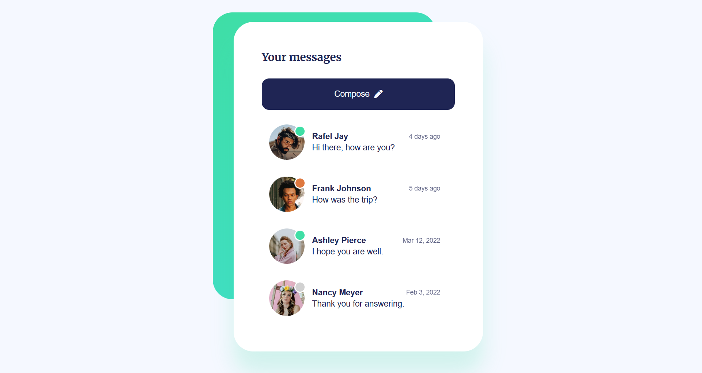

# Inbox UI Design

A clean and modern inbox interface built with HTML and CSS, designed as a pixel-accurate implementation of its original Figma layout.
The project features user cards, status indicators, responsive sizing, and smooth interaction details.

---
## Figma Design

👉**Figma Design Link:** https://www.uidesigndaily.com/posts/inbox-ui-design

---
## Live Demo

👉 **Live Site:** https://inbox-ui-design.netlify.app/

---
##  Features

- Pixel-perfect reproduction of the original Figma design
- Clean, semantic, well-structured HTML
- Modern CSS architecture using custom variables
- Status indicators for users (active • waiting • away) via pseudo-elements
- Hover interactions for each user row
- Responsive fonts and avatar sizing using `clamp()`
- Professional typography with Google Fonts

---
## Tech Stack

- **HTML5**
- **CSS3** 
- **Google Fonts (Merriweather & Poppins)**
- **Font Awesome Icons**

---
## Purpose of the Project
This project was created to practice:
- Translating static UI designs into accurate, production-ready code
- Using modern CSS techniques such as custom variables, gradients, shadows, and responsive units
- Building visually consistent components 
- Improving layout structuring and interaction design skills
 
---
## 📌Notes
- All spacing, colors, typography, and radii were matched carefully to the original design.
- Status indicators are implemented using CSS pseudo-elements with fully theme-driven colors.
- The layout is centered and scalable, adapting to different viewport sizes without media queries thanks to clamp().

