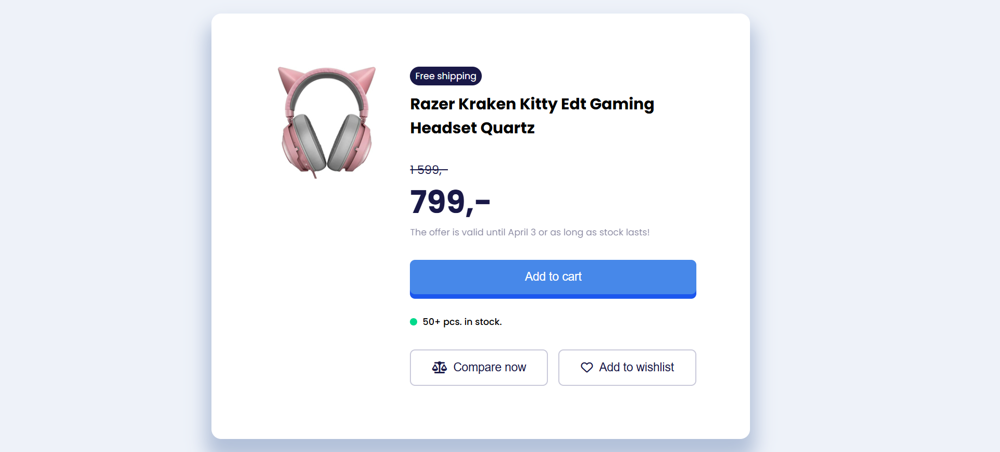

# Product Info UI Design

A clean and responsive product information card built as a pixel-perfect implementation of its original Figma design.
The project focuses on faithful visual reproduction, well-structured HTML, and modern CSS practices.

---
## 🎨Figma Design

👉**Figma Design Link:** https://www.uidesigndaily.com/posts/figma-product-info-ui-design-card-day-1575

---
## Live Demo

👉 **Live Site:** https://product-info-ui-design.netlify.app/

---
##  Features

- Pixel-perfect reproduction of the Figma layout
- Responsive and flexible structure (Flexbox + media queries)
- Consistent styling using custom CSS variables
- Smooth hover interactions for buttons
- Clean and semantic HTML structure

---
## Tech Stack

- **HTML5**
- **CSS3** 
- **Google Fonts (Poppins)**
- **Font Awesome Icons**

---
## Purpose of the Project

 This project was created to practice pixel-perfect front-end development, strengthen CSS layout and interaction skills, and accurately translate a static Figma design into clean, production-ready code.
 
---
## 📌Notes
All measurements were matched precisely with the Figma file, including spacing, typography, border radii, and color values, to ensure a fully accurate, pixel-perfect result.

