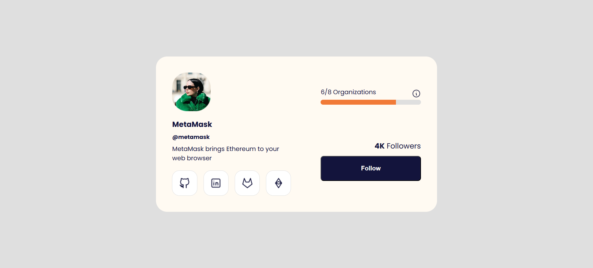

# Profile Header UI — Responsive Figma-Perfect Design

A clean and modern profile header component developed as a pixel-perfect implementation of its original Figma design.  
This project focuses on visual accuracy, scalable CSS architecture, and clean, maintainable HTML.

---

## 🎨 Figma Design

**Figma Link:** *https://www.uidesigndaily.com/posts/figma-profile-page-header-card-day-1580*

---

## 🚀 Live Demo

**Live Site:** *https://profilepageheader.netlify.app/*

---

## ✨ Features

- Pixel-perfect layout matching the Figma file  
- Fully responsive structure (Flexbox + clamp + media queries)  
- Consistent styling through CSS variables  
- Smooth hover animations for interactive elements  
- Clean and semantic HTML5 markup  
- Scalable component-based CSS organization  

---

## 🛠️ Tech Stack

- **HTML5**  
- **CSS3** (Flexbox, clamp, media queries)  
- **Google Fonts — Poppins**  
- **SVG / PNG icons**

---

## 🎯 Purpose of the Project

This project was developed to:

- Practice converting a static Figma design into a fully functional UI  
- Strengthen pixel-perfect development skills  
- Build responsive layouts without external frameworks  
- Improve CSS structure using variables, spacing systems, and consistent rules  
- Create a reusable component that matches design specs exactly  

---

## 📌 Notes

Spacing, typography, colors, and border radii were all matched precisely to the Figma reference, ensuring a fully accurate and polished result.  
The codebase is structured for readability, modularity, and long-term maintainability.

---
